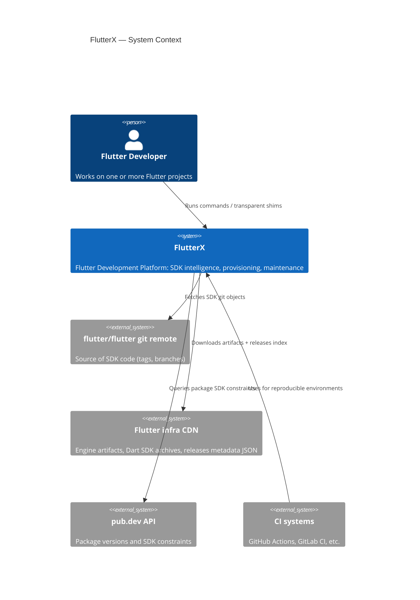
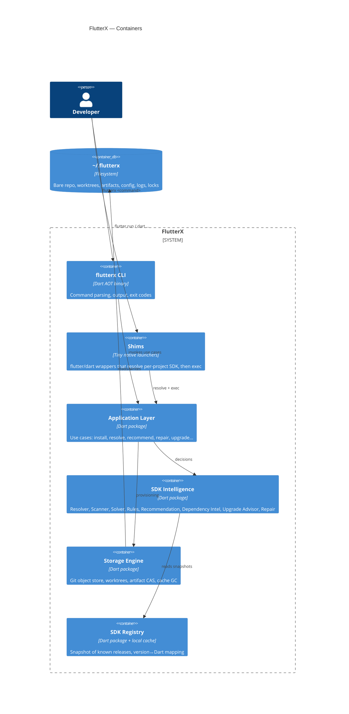
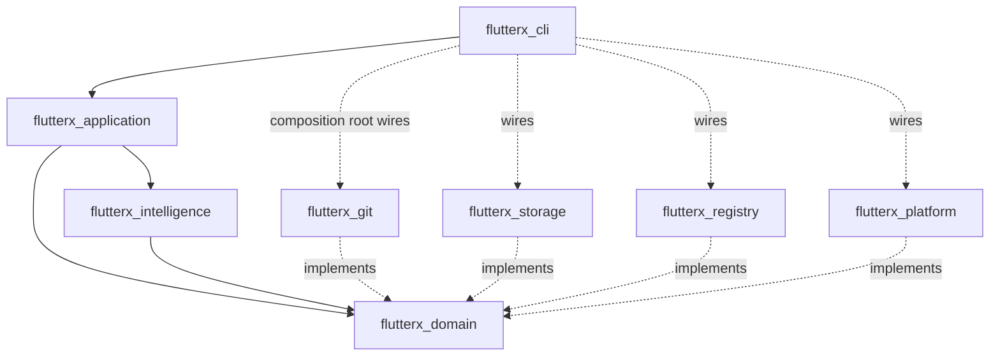
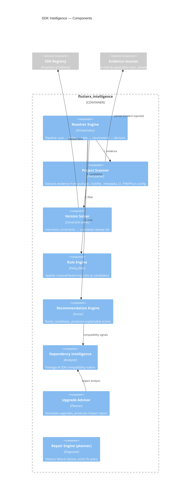
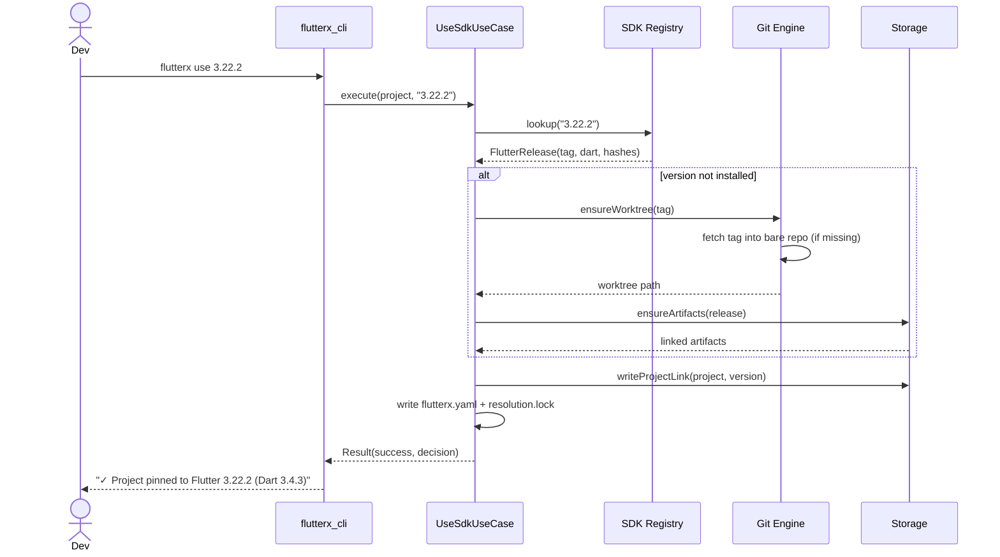
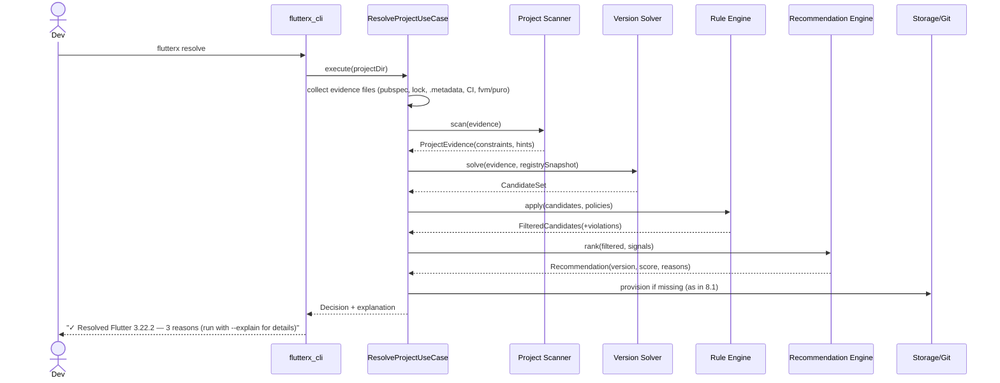
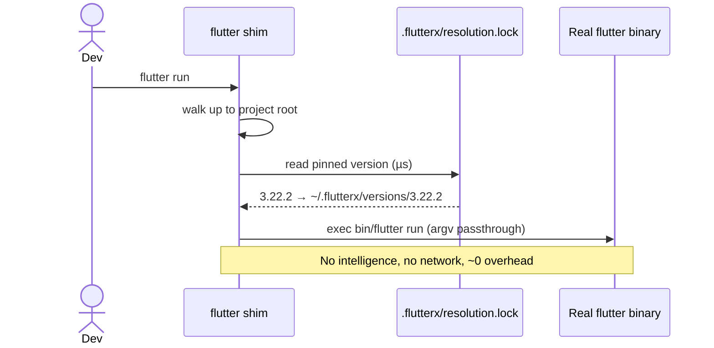
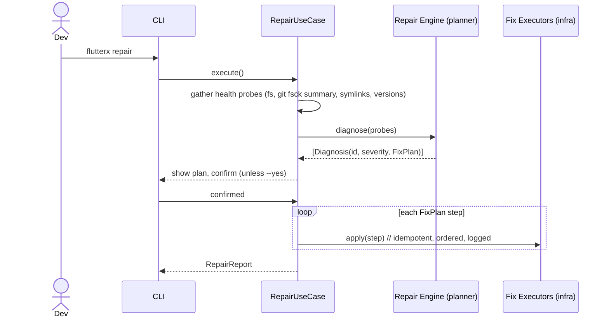

# FlutterX — System Architecture

> **Document status:** Draft v1.0 · Design phase
> **Audience:** Implementers and reviewers
> **Related docs:** [03-sdk-intelligence.md](03-sdk-intelligence.md) · [05-storage-design.md](05-storage-design.md) · [06-package-design.md](06-package-design.md)

---

## 1. Architectural Drivers

The architecture is derived from the product goals in [01-product-vision.md](01-product-vision.md):

| Driver | Architectural consequence |
|---|---|
| SDK Intelligence is the core product | Intelligence lives in its own package with **no CLI or I/O dependencies**, so it is testable and embeddable (IDE, CI, daemon) |
| Cross-platform parity | All OS specifics behind a `Platform` abstraction; no `dart:io` path logic outside infrastructure |
| Explainability | Every engine returns a *decision object* (result + evidence + score), never a bare value |
| Determinism | Resolution produces a lockfile; engines are pure functions of (project evidence, registry snapshot, rules) |
| Contributor-friendly | Clean Architecture, one responsibility per package, dependency rule enforced in CI |
| Future daemon/IDE | Application layer exposes use cases as plain Dart APIs; the CLI is just one adapter |

## 2. Style: Clean Architecture

FlutterX uses Clean Architecture with the dependency rule **pointing inward**:

```
Presentation (CLI, future: daemon, IDE bridge)
        │ depends on
        ▼
Application (use cases / orchestration)
        │ depends on
        ▼
Domain (entities, value objects, engine interfaces, rules)
        ▲ implemented by
        │
Infrastructure (git, filesystem, HTTP, process, OS)
```

**Why Clean Architecture (decision record):**
- The intelligence engines must run headless (tests, daemon, CI action). Keeping them free of I/O makes that trivial: infrastructure is injected as interfaces.
- Contributors can change the git strategy, HTTP client, or output formatting without touching decision logic.
- The cost (more interfaces, some indirection) is acceptable because the domain is genuinely complex; this is not ceremony for a CRUD app.

Rules enforced in CI (see [08-contributing-guide.md](08-contributing-guide.md)):
1. `domain` imports nothing but the Dart SDK core libraries and `flutterx_domain` itself.
2. `application` imports `domain` only.
3. `infrastructure` implements `domain` interfaces; never the reverse.
4. `cli` imports `application` (+ formatting utils); never `infrastructure` directly except in the composition root.

## 3. High-Level Architecture (C4 Level 1 — System Context)



## 4. Container View (C4 Level 2)



## 5. Package Map and Responsibilities

The monorepo (managed with `melos`) contains these packages. Full API design in [06-package-design.md](06-package-design.md).

| Package | Layer | Responsibility | Depends on |
|---|---|---|---|
| `flutterx_domain` | Domain | Entities (`FlutterRelease`, `Project`, `Resolution`, `Diagnosis`…), value objects (`SemVer`, `Channel`), engine **interfaces**, rule contracts | — |
| `flutterx_intelligence` | Domain services | Implementations of Resolver, Scanner (parsing logic), Version Solver, Rule Engine, Recommendation, Dependency Intelligence, Upgrade Advisor, Repair planner — all pure | `flutterx_domain` |
| `flutterx_application` | Application | Use cases (`InstallSdk`, `UseSdk`, `ResolveProject`, `RepairEnvironment`…), orchestration, transactions, lockfile handling | `flutterx_domain`, `flutterx_intelligence` |
| `flutterx_git` | Infrastructure | Git operations: bare repo mgmt, fetch, worktree add/remove, integrity checks | `flutterx_domain` |
| `flutterx_storage` | Infrastructure | Filesystem layout, artifact CAS, download manager, cache GC, file locks | `flutterx_domain` |
| `flutterx_registry` | Infrastructure | Releases-index client, pub.dev client, local snapshot cache | `flutterx_domain` |
| `flutterx_platform` | Infrastructure | OS abstraction: paths, env, process exec, symlink/junction, shell detection | `flutterx_domain` |
| `flutterx_cli` | Presentation | Argument parsing, command tree, TTY output/spinners/tables, exit codes, composition root | `flutterx_application` (+ infra wired at root) |



## 6. Component View (C4 Level 3 — SDK Intelligence)



Note the seam: **Scanner parses content, it does not read files.** The application layer gathers file contents via infrastructure and injects them. This keeps every engine deterministic and unit-testable with plain strings.

## 7. Runtime Architecture

### 7.1 Process model

- **`flutterx`** — short-lived AOT-compiled Dart binary. One invocation = one use case.
- **Shims** — `~/.flutterx/bin/flutter` and `dart`: minimal launchers that (a) find the project root, (b) read `.flutterx/resolution.lock` (fast path, no intelligence), (c) `exec` the real SDK binary. Cold path (no lock) delegates to `flutterx resolve`.
- **Concurrency safety** — all mutations of `~/.flutterx` take an advisory file lock (`locks/store.lock`); read paths are lock-free. Two `flutterx install` invocations serialize; `flutter run` via shim never blocks on the lock.
- **Future daemon (v2)** — same application layer hosted in a long-lived process over JSON-RPC; no redesign required because presentation is already an adapter.

### 7.2 Data at rest

Authoritative layout in [05-storage-design.md](05-storage-design.md). Summary:

```
~/.flutterx/
├── config.yaml            # global config + user prefs
├── bin/                   # shims on PATH
├── cache/
│   ├── git/flutter.git    # single bare repo (shared objects)
│   ├── registry/          # releases + pub metadata snapshots
│   └── downloads/         # resumable partial downloads
├── versions/<version>/    # git worktrees (checked-out SDKs)
├── artifacts/engine/<sha>/# content-addressed shared artifacts
├── locks/
└── logs/
```

Per project:

```
project/
├── flutterx.yaml          # committed: pin/policy ("what we want")
└── .flutterx/             # gitignored except lock
    ├── resolution.lock    # committed: resolved decision ("what we got")
    └── sdk -> ~/.flutterx/versions/3.22.2   # symlink/junction
```

## 8. Request Flows

### 8.1 `flutterx use 3.22.2` (explicit pin)



### 8.2 `flutterx resolve` (intelligent path — the flagship flow)



### 8.3 Shim fast path (`flutter run` in a resolved project)



Cold path: lock missing → shim prints a one-line hint and (configurable) invokes `flutterx resolve` first.

### 8.4 `flutterx repair`



## 9. Error-Handling & Observability Strategy

- **Typed failures.** Domain operations return `Result<T>` (success value or an `FxFailure` — definition in [06-package-design.md](06-package-design.md) §2.1); failures carry a stable `code` (e.g. `FX-GIT-003 partial-fetch-failed`) used in docs and issue templates. Exceptions are reserved for programmer errors.
- **Exit codes** are a public contract (defined in [04-cli-specification.md](04-cli-specification.md)).
- **Structured logs** to `~/.flutterx/logs/` (JSON lines, rotated); `--verbose` mirrors to stderr. No network telemetry.
- **Every mutation is journaled** (intent → steps → outcome) so `repair` can roll back or complete interrupted operations (crash-safe provisioning; see [05-storage-design.md](05-storage-design.md) §7).

## 10. Extensibility Points

Designed-in seams (stable from Beta onward):

1. **Rules** — implement `Rule` (domain interface); registered via config. Team policies are just rules loaded from `flutterx.yaml`/org files.
2. **Evidence extractors** — Scanner is a pipeline of `EvidenceExtractor`s; adding "read Bitrise config" is one class.
3. **Repair strategies** — `Diagnosis` → `FixPlan` pairs are pluggable.
4. **Presentation adapters** — CLI today; daemon (JSON-RPC) and GitHub Action reuse the same use cases.
5. **Artifact transports** — download source behind an interface → org mirrors later.

## 11. Key Design Decisions (ADR summary)

| ID | Decision | Alternatives considered | Rationale |
|---|---|---|---|
| ADR-1 | Dart as implementation language | Rust, Go | Audience = Flutter devs (contributor pool), reuse of `pub_semver`/`yaml`, AOT gives fast startup; shims cover the hot path |
| ADR-2 | Bare repo + worktrees for SDK storage | Full clones (FVM-style), tarball extraction | Proven by Puro; ~O(1) marginal cost per version |
| ADR-3 | Content-addressed artifact store | Per-version artifact dirs | Identical engine binaries shared across versions; integrity = free (hash is the address) |
| ADR-4 | Engines are pure; I/O injected | Engines read disk directly | Determinism, unit tests with strings, daemon/IDE reuse |
| ADR-5 | Two project files: `flutterx.yaml` (intent) + `resolution.lock` (outcome) | Single file | Mirrors pubspec/pubspec.lock mental model; lock enables byte-identical CI |
| ADR-6 | Shims resolve via lockfile only (no intelligence in hot path) | Always-resolve shims | `flutter run` latency must be ~0; intelligence runs explicitly or on lock miss |

---

*Next: [03-sdk-intelligence.md](03-sdk-intelligence.md) — the engines in depth, with algorithms and edge cases.*
