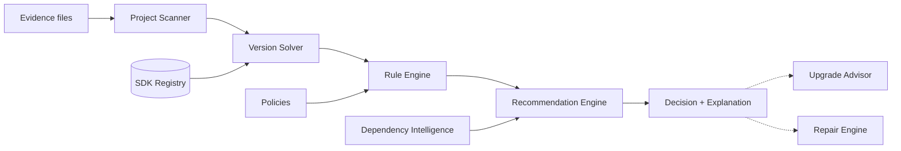
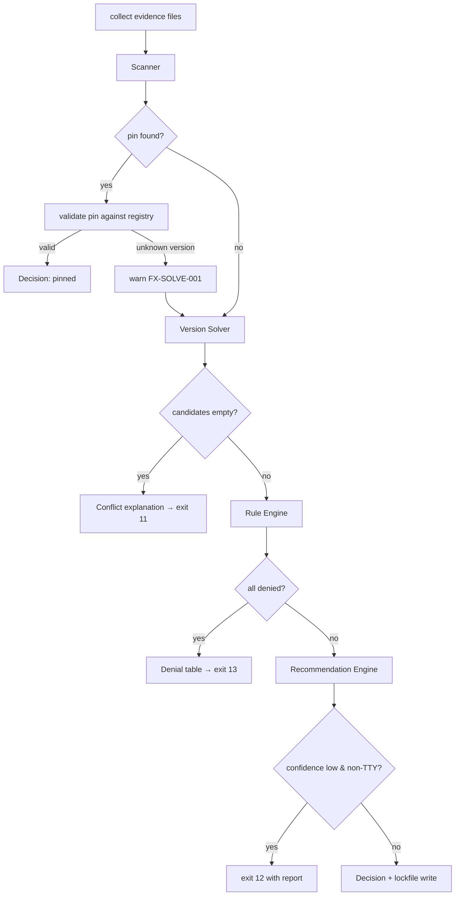

# FlutterX — SDK Intelligence

> **Document status:** Draft v1.0 · Design phase
> **Audience:** Implementers of `flutterx_intelligence` and `flutterx_registry`
> **Related docs:** [02-system-architecture.md](02-system-architecture.md) · [06-package-design.md](06-package-design.md)

SDK Intelligence is FlutterX's core innovation: a pipeline that turns *project evidence* into an *explainable SDK decision*, and keeps that decision healthy over time.



**Shared design principles (apply to every engine):**

1. **Pure functions.** Engines receive parsed inputs and snapshots; they never touch disk or network. The application layer performs I/O.
2. **Explainable outputs.** Every result carries the evidence and rule/score trail that produced it.
3. **Deterministic.** Same inputs → same output, always. Randomness and wall-clock time are injected if ever needed.
4. **Fail soft.** Missing evidence lowers confidence; it never crashes the pipeline.

---

## 1. SDK Registry

The Registry is the knowledge base every other engine consults: *which Flutter releases exist, and what are their properties?*

### 1.1 Data model

```dart
class FlutterRelease {
  final SemVer version;          // 3.22.2
  final Channel channel;         // stable | beta | dev (archived, historical releases only) | master
  final String gitTag;           // "3.22.2"
  final String frameworkSha;     // commit hash
  final SemVer dartVersion;      // 3.4.3  ← critical for solving
  final DateTime releasedAt;
  final Map<Platform, ArtifactRef> artifacts; // engine/dart archives + sha256
  final bool retracted;          // known-bad releases
}

class RegistrySnapshot {
  final List<FlutterRelease> releases;   // sorted desc
  final DateTime fetchedAt;
  final String source;                   // url or "cache"
}
```

### 1.2 Sources and refresh

| Source | Provides | Refresh policy |
|---|---|---|
| Flutter `releases_<os>.json` index | versions, channels, hashes, Dart version, archives | TTL 6h; `--refresh` forces; offline → last snapshot with warning |
| `flutter/flutter` git tags (via bare repo) | tags newer than index, master builds | on `install`/`fetch` |
| Bundled seed snapshot | bootstrap when fully offline on first run | shipped with each FlutterX release |

The **Flutter version ↔ Dart version mapping** is the single most important fact in the registry: pubspec files constrain the *Dart* SDK (`environment: sdk:`), while users think in *Flutter* versions. The registry is the bidirectional translation table.

**Edge cases**
- *Retracted/broken releases* (e.g. a hotfix superseded within days): marked `retracted`, excluded by default rule, installable only with `--force`.
- *Index lists a release before the CDN has all artifacts:* installation verifies artifact availability and falls back to next candidate with a warning.
- *Clock skew / stale cache in CI:* snapshot age is part of the explanation ("registry snapshot is 40 days old — run `flutterx cache refresh`").

---

## 2. Project Scanner

Extracts **evidence** from a project. Pure parser: file contents are injected.

### 2.1 Evidence sources (ordered by strength)

| # | Source | Evidence extracted | Strength |
|---|---|---|---|
| 1 | `.flutterx/resolution.lock` | exact prior decision | pin (exact) |
| 2 | `flutterx.yaml` | pinned version or policy | pin / policy |
| 3 | `.fvmrc` / `.fvm/fvm_config.json` | FVM pin (migration) | pin |
| 4 | `.puro.json` | Puro pin (migration) | pin |
| 5 | `pubspec.yaml → environment.sdk` | Dart constraint, e.g. `>=3.4.0 <4.0.0` | hard constraint |
| 6 | `pubspec.yaml → environment.flutter` | Flutter constraint (rarely set) | hard constraint |
| 7 | `pubspec.lock` | resolved packages + their SDK needs | hard constraint (via Dependency Intelligence) |
| 8 | `.metadata` | Flutter version that created/last migrated the project | soft hint |
| 9 | CI files (`.github/workflows/*.yml`, `codemagic.yaml`, …) | `flutter-version:` fields | soft hint |
| 10 | Global config default | fallback channel/version | weakest |

### 2.2 Output

```dart
class ProjectEvidence {
  final List<PinEvidence> pins;            // sources 1–4
  final List<ConstraintEvidence> hard;     // sources 5–7 (VersionConstraint each)
  final List<HintEvidence> hints;          // sources 8–9 (version + weight)
  final ProjectKind kind;                  // app | package | plugin | workspaceMember
  final List<ScanWarning> warnings;        // unparseable files, conflicts among pins
}
```

### 2.3 Algorithm

```
scan(files):
  evidence = ProjectEvidence()
  for extractor in registeredExtractors (ordered):     # pipeline, pluggable
      if extractor.appliesTo(files):
          result = extractor.extract(files)             # never throws
          evidence.merge(result)                        # collect warnings on parse errors
  classify project kind (app vs package: presence of lib/main.dart, flutter dependency, workspace file)
  return evidence
```

**Edge cases**
- *Conflicting pins* (`.fvmrc` says 3.19.0, `flutterx.yaml` says 3.22.2): highest-priority source wins; a `ScanWarning.conflictingPins` is attached and always displayed.
- *Malformed YAML:* extractor records a warning with line info; pipeline continues.
- *No pubspec at all:* not a Dart project → resolution degrades to "global default" with `confidence: low`.
- *Workspace member:* evidence includes the workspace root's policy (see `workspace` command in [04-cli-specification.md](04-cli-specification.md)).
- *Monorepo with multiple apps:* scanning is per-package; the workspace policy reconciles (one SDK for all, or per-package).

---

## 3. Version Solver

Turns evidence + registry into a **candidate set** of releases that *can* work.

### 3.1 Algorithm

Constraint intersection over the registry, in Flutter-version space:

```
solve(evidence, snapshot):
  if evidence.pins is non-empty:
      pin = highestPriority(evidence.pins)
      release = snapshot.find(pin.version)
      if release exists: return CandidateSet.pinned(release, provenance=pin)
      else: record failure FX-SOLVE-001 (pinned version unknown) and continue without pin

  C = snapshot.releases                       # start: all known releases
  for c in evidence.hard:
      if c is DartConstraint:
          C = { r ∈ C | c.allows(r.dartVersion) }        # translate via registry mapping
      if c is FlutterConstraint:
          C = { r ∈ C | c.allows(r.version) }
      record |C| after each step                          # for explanation

  if C is empty:
      return CandidateSet.empty(conflictTrace)            # which constraint zeroed the set
  return CandidateSet(C, provenance=trace)
```

Complexity: O(R × K) for R releases (~400 historic) and K constraints (<10) — trivially fast; no SAT solving needed because constraints are intersections over one variable. (Package-level constraint interplay is handled by Dependency Intelligence, §6, which delegates real dependency resolution to `pub`.)

### 3.2 Conflict explanation

When `C` becomes empty the solver returns the **minimal conflicting pair**:

```
✗ No Flutter release satisfies all constraints:
    pubspec.yaml       requires Dart >=3.5.0  (→ Flutter >=3.24.0)
    .metadata hint     suggests Flutter 3.19.x (ignored — hint only)
    ci workflow        requires Flutter <3.22.0 (→ Dart <3.4.0)
  Conflict: pubspec.yaml × ci workflow.
  Suggestion: update .github/workflows/build.yml flutter-version, or relax pubspec sdk constraint.
```

**Edge cases**
- *Pre-release constraints* (`>=3.4.0-0`): honored per pub_semver semantics.
- *Constraint `any`:* contributes nothing; noted in trace.
- *Registry gap* (constraint maps to a Dart version no stable release ships): candidates may come from beta channel — the Rule Engine decides whether beta is allowed.

---

## 4. Rule Engine

Filters and annotates candidates according to **policies**. Rules make FlutterX team-ready.

### 4.1 Contract

```dart
abstract interface class Rule {
  String get id;                     // "channel-policy", "deny-retracted", ...
  RuleVerdict evaluate(FlutterRelease r, RuleContext ctx);
}
class RuleVerdict {
  final RuleAction action;           // allow | deny | penalize(score) | prefer(score)
  final String reason;               // human-readable, shown in --explain
}
```

Rules are evaluated **independently per candidate**; deny wins over everything; penalties/preferences feed the Recommendation Engine as score modifiers. Order-independence keeps rules composable and testable.

### 4.2 Built-in rules (v1)

| Rule id | Default | Behavior |
|---|---|---|
| `deny-retracted` | on | Deny releases marked retracted |
| `channel-policy` | `stable` | Deny releases outside allowed channels (config: `stable`, `beta`, `any`) |
| `min-version-floor` | off | Org floor, e.g. deny `<3.16.0` (security baseline) |
| `deny-list` / `allow-list` | off | Explicit version lists from team policy |
| `freshness-window` | off | Deny releases older than N months (compliance) |
| `prefer-lts-like` | on | Prefer latest patch of a minor over the newest minor (stability bias, `+5`) |

### 4.3 Policy sources and precedence

`org policy file` (if configured) → `workspace flutterx.yaml` → `project flutterx.yaml` → `global config` → built-in defaults. More specific **may only tighten**, never loosen, org policy (org sets `lockdown: true` per rule to enforce).

**Edge cases**
- *All candidates denied:* Rule Engine returns the denial table so the CLI can show exactly which rule killed which candidate, and which single rule relaxation would unblock (computed by re-running with each rule disabled — cheap at this scale).
- *Unknown rule id in config:* warning + ignored (forward compatibility), unless `strictPolicies: true`.

---

## 5. Recommendation Engine

Ranks allowed candidates and produces the final **explainable decision**.

### 5.1 Scoring model

Weighted additive score; weights are config-tunable but ship with defaults:

| Signal | Weight | Notes |
|---|---|---|
| Satisfies all hard constraints | required | not scored — gatekeeping already done |
| Hint match (`.metadata`, CI version) | +30 per matching hint | familiarity = fewer surprises |
| Latest patch of its minor | +20 | hotfixes are safe |
| Dependency Intelligence compatibility | +0…40 | §6 — fraction of deps verified compatible |
| Channel = stable | +15 | |
| Recency (half-life 180 days) | +0…10 | mild bias to newer |
| Rule `prefer`/`penalize` modifiers | ±rule-defined | |
| Already installed locally | +8 | zero-cost provisioning tiebreaker |

```
recommend(candidates, signals):
  for r in candidates:
      score[r] = Σ weighted signals(r)     # each contribution recorded as Reason(text, delta)
  sort by (score desc, version desc)       # version desc = deterministic tiebreak
  return Recommendation(
      chosen = top,
      alternatives = next 2,
      confidence = f(score gap, evidence strength),   # high | medium | low
      reasons = top.contributions)
```

### 5.2 Confidence and behavior

| Confidence | Condition (illustrative) | Default CLI behavior |
|---|---|---|
| High | pin, or single candidate, or gap ≥ 25 pts with hard evidence | auto-apply |
| Medium | gap 10–25 pts | apply, print alternatives |
| Low | only hints/global default | prompt (TTY) / fail with code 12 (CI, unless `--accept-low`) |

### 5.3 Example output

```
$ flutterx resolve --explain
Resolved: Flutter 3.22.2 (Dart 3.4.3) — confidence: high

  +30  .metadata says project created with 3.22.x
  +40  38/38 locked packages verified compatible
  +20  3.22.2 is the latest patch of 3.22
  +15  stable channel (policy: stable-only)
  + 8  already installed
  ───
  113  vs. runner-up 3.24.1 (score 71: newer, but 2 packages unverified)
```

**Edge cases**
- *Empty candidate set:* engine is skipped; solver's conflict explanation is the output.
- *Tie:* higher version wins (deterministic); both shown.
- *Weights misconfigured (negative required signals etc.):* config validation rejects at load time, not at decision time.

---

## 6. Dependency Intelligence

Answers: *"will this project's packages actually work on candidate SDK X?"* — the difference between "constraint-satisfying" and "actually builds".

### 6.1 Two modes

**Fast mode (default, offline-capable).** Uses `pubspec.lock` + cached pub metadata:

```
compatible(release, lockfile, pubCache):
  unknown = []
  for pkg in lockfile.packages:
      meta = pubCache.get(pkg.name, pkg.version)     # SDK constraints from pub.dev, cached
      if meta missing: unknown.add(pkg); continue
      if not meta.sdkConstraint.allows(release.dartVersion): return Incompatible(pkg)
      if meta.flutterConstraint exists and not allows(release.version): return Incompatible(pkg)
  return Compatible(verified: total-|unknown|, unverified: unknown)
```

**Deep mode (`--deep`).** Runs the real resolver: `dart pub get --dry-run` (offline first, then online) against the candidate SDK in a temp context. Authoritative but slower and network-dependent. Used automatically by the Upgrade Advisor.

### 6.2 Compatibility matrix

For `flutterx recommend --matrix`, results are presented per candidate:

```
              3.19.6   3.22.2   3.24.1
riverpod       ✓        ✓        ✓
freezed        ✓        ✓        ✗ (needs analyzer >=6.5 → Dart >=3.5)
camera         ✓        ✓        ?  (no cached metadata)
```

**Edge cases**
- *Git/path dependencies:* SDK constraints unknown without fetching → marked `?`, counted as unverified, never as incompatible.
- *Lockfile absent:* fast mode falls back to `pubspec.yaml` direct deps only; confidence penalty applied.
- *pub.dev unreachable:* cached metadata used; unverifiable packages reduce the compatibility score contribution, never block.

---

## 7. Resolver Engine (orchestrator)

The Resolver is the pipeline conductor — it owns **no domain logic** of its own.



The Decision object is serialized into `.flutterx/resolution.lock`:

```yaml
# .flutterx/resolution.lock — generated by flutterx; commit this file.
flutterx: 1            # lock format version
flutter: 3.22.2
dart: 3.4.3
channel: stable
resolvedAt: 2026-07-11T03:12:44Z
resolvedBy: resolve    # resolve | use | migrate
evidenceHash: sha256:9f2c…   # hash of evidence inputs → staleness detection
reasons:
  - "pin: none; solved from constraints"
  - "hint: .metadata 3.22.x (+30)"
```

`evidenceHash` lets `flutterx doctor` detect that pubspec changed since resolution ("lock is stale — run `flutterx resolve`") without re-running the pipeline.

---

## 8. Upgrade Advisor

Plans SDK upgrades **before** touching anything.

### 8.1 Algorithm

```
advise(project, target?, snapshot):
  current = project.lock.flutter
  target  = target ?? recommend(candidates > current).chosen
  report  = UpgradeReport(current, target)

  # 1. SDK-level diff
  report.sdkDelta = classify(current → target)     # patch | minor | major
  report.dartDelta = dartVersion diff

  # 2. Dependency impact (deep mode)
  sim = dependencyIntelligence.deep(target, project)
  report.blocking   = packages that cannot resolve on target
  report.needsBump  = packages resolvable only with newer versions (with exact suggestions)
  report.unaffected = rest

  # 3. Breaking-change knowledge
  report.notes = knowledgeBase.entriesBetween(current, target)
      # curated YAML in the repo: deprecations, migration guides, tool behavior changes

  # 4. Verdict
  if blocking.isEmpty and sdkDelta <= minor: verdict = SAFE
  elif blocking.isEmpty:                     verdict = SAFE_WITH_CHANGES
  else:                                      verdict = BLOCKED(remediations)
  return report
```

### 8.2 Example

```
$ flutterx upgrade --advise
Upgrade plan: 3.19.6 → 3.22.2 (minor, Dart 3.3.4 → 3.4.3)

  ✓ 34 packages unaffected
  ⚠ 3 packages need version bumps:
      freezed        2.4.7 → 2.5.2
      build_runner   2.4.8 → 2.4.11
      go_router      13.2.0 → 14.1.4   (has breaking changes — see notes)
  ✗ 0 blocking packages

  Notes from 3.19 → 3.22:
    • `flutter build ipa` now requires Xcode 15 (tooling)
    • go_router 14 renames `GoRouteData.location` (migration guide linked)

Verdict: SAFE WITH CHANGES.
Apply with: flutterx upgrade --to 3.22.2 --bump-deps
```

**Edge cases**
- *Downgrade requested:* allowed, but lockfile-created files newer than target's format trigger explicit warnings (e.g. `pubspec.lock` format, `.dart_tool` caches are wiped).
- *Target below a hard constraint:* refused with the same conflict explanation machinery as the solver.
- *Apply interrupted:* upgrade apply is journaled; `flutterx repair` completes or rolls back (§9, [05-storage-design.md](05-storage-design.md) §7).

---

## 9. Repair Engine

Detect → plan → fix, deterministic and idempotent.

### 9.1 Failure catalogue (initial)

| Diagnosis id | Detection probe | Fix plan |
|---|---|---|
| `FX-R01 broken-project-link` | `.flutterx/sdk` symlink target missing | re-link from lock; provision if version missing |
| `FX-R02 stale-lock` | `evidenceHash` mismatch | prompt re-resolve (auto with `--yes`) |
| `FX-R03 corrupt-worktree` | `git status` fails / missing files vs manifest | `git worktree remove` + recreate from bare repo |
| `FX-R04 corrupt-bare-repo` | `git fsck` errors | re-fetch objects; last resort: re-clone (destructive → confirm) |
| `FX-R05 missing-artifacts` | required artifact hash absent from CAS | re-download (resumable) |
| `FX-R06 orphaned-versions` | worktree not referenced by any project/lock and older than TTL | offer GC (delegates to `cache gc`) |
| `FX-R07 shim-drift` | shims missing from PATH or outdated version | reinstall shims, print PATH guidance |
| `FX-R08 interrupted-journal` | journal entry without `committed` marker | roll forward or roll back per journal type |
| `FX-R09 dart-flutter-mismatch` | version file ≠ registry mapping for that tag | recheckout worktree at correct tag |

### 9.2 Pipeline

```
repair(scope = all):
  probes    = run health probes (read-only, parallel)
  diagnoses = catalogue.match(probes)                    # pure
  plans     = order by (severity desc, dependency order) # e.g. fix bare repo before worktrees
  show plan; confirm unless --yes
  for step in plans.flatMap(steps):
      journal.begin(step); execute; journal.commit(step) # each step idempotent
  re-probe fixed areas → RepairReport(fixed, skipped, failed)
```

Design rules:
- **Read-only diagnosis.** `flutterx doctor` runs the identical probes and prints diagnoses without fixing — Repair = doctor + executor.
- **Idempotent steps.** Running repair twice is always safe.
- **Destructive fixes require explicit confirmation** even under `--yes` unless `--force` (e.g. re-clone bare repo).

---

## 10. Cross-Engine Example (end to end)

Project: cloned repo, no FlutterX files, has `pubspec.yaml` (`sdk: >=3.3.0 <4.0.0`), `pubspec.lock` (41 packages), `.metadata` (created with 3.19.0), GitHub workflow pinning `3.19.6`.

1. **Scanner:** no pins; hard constraint Dart `>=3.3.0 <4.0.0`; hints: 3.19.x (+metadata), 3.19.6 (+CI).
2. **Solver:** Dart constraint → Flutter `3.10.0 … 3.27.x` ⇒ 61 candidates.
3. **Rules:** stable-only + deny-retracted ⇒ 38 candidates.
4. **Dependency Intelligence (fast):** 3.19.6: 41/41 ✓ · 3.22.2: 41/41 ✓ · 3.24.1: 39/41 ✓.
5. **Recommendation:** 3.19.6 wins (hints +60, full compatibility +40) over 3.22.2 (+0 hints) — *familiarity beats recency by design*; output suggests `flutterx upgrade --advise` for moving to 3.22.2 deliberately.
6. **Decision** written to `resolution.lock`; SDK provisioned in seconds via worktree.

This demonstrates the philosophy: **FlutterX picks the version the project was demonstrably built for, and makes moving forward a conscious, simulated, safe step.**

---

*Next: [04-cli-specification.md](04-cli-specification.md) — the user-facing surface of these engines.*
