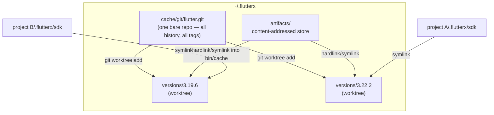
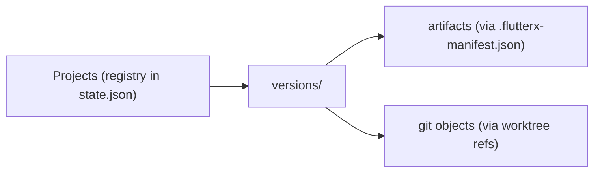

# FlutterX — Storage Design

> **Document status:** Draft v1.0 · Design phase
> **Audience:** Implementers of `flutterx_storage` and `flutterx_git`
> **Related docs:** [02-system-architecture.md](02-system-architecture.md) · [03-sdk-intelligence.md](03-sdk-intelligence.md) §9 (Repair)

Storage is FlutterX's second pillar (after intelligence): install N SDK versions for roughly the cost of one, provision new versions in seconds, and survive crashes and corruption.

---

## 1. The Problem, Quantified

A full Flutter SDK checkout consists of:

| Part | Approx size | Varies per version? |
|---|---|---|
| Framework git checkout (`flutter/flutter`) | ~1.5–2 GB history + ~250 MB tree | history ~shared; tree differs slightly |
| Dart SDK (bundled, downloaded) | ~500 MB | per version |
| Engine artifacts (`bin/cache/artifacts`) | ~1–3 GB depending on targets | **largely identical across nearby versions** |
| pub cache | ~varies | shared already (`~/.pub-cache`) |

Naive strategy (FVM-style full copies): 5 versions ≈ 15–25 GB. Observation: **git history is one object database, and most artifacts are byte-identical between adjacent releases.** FlutterX exploits both.

## 2. Strategy Overview



Three mechanisms:

1. **Git-based SDK strategy** — one bare repository holds every version's history; each installed version is a *worktree* (checkout only, no duplicated object database). Marginal cost per version ≈ working tree only (~250 MB), not 2 GB.
2. **Content-addressed artifact storage (CAS)** — engine/Dart artifacts stored once per unique content hash and linked into each version's `bin/cache`. Identical binaries across versions cost zero extra bytes.
3. **Reference counting + GC** — projects reference versions (symlinks + lock registry); versions reference artifacts (manifests); anything unreferenced is reclaimable.

## 3. Directory Layout (authoritative)

```
~/.flutterx/
├── config.yaml                    # global config (documented keys only)
├── state.json                     # store metadata: schema version, project registry
├── bin/                           # shims: flutter, dart, flutterx  (on PATH)
│
├── cache/
│   ├── git/
│   │   └── flutter.git/           # bare repo, single origin=flutter/flutter
│   ├── registry/
│   │   ├── releases-<os>.json     # snapshot + etag + fetchedAt
│   │   └── pub/<package>/<ver>.json  # cached pub.dev metadata (Dependency Intel)
│   └── downloads/
│       └── <sha256>.partial       # resumable downloads (atomic rename on completion)
│
├── versions/
│   └── 3.22.2/                    # git worktree of tag 3.22.2
│       ├── bin/…                  # framework tree as checked out
│       ├── bin/cache/…            # artifact links into ../artifacts + version-local files
│       └── .flutterx-manifest.json# what this version links from CAS (refs)
│
├── artifacts/
│   └── sha256/
│       └── ab/abcd…ef/            # content-addressed blob or dir (sharded by prefix)
│           └── payload
│
├── locks/
│   └── store.lock                 # advisory lock for store mutations
├── journal/
│   └── 2026-07-11T03-12-44-install-3.22.2.json   # crash-safe operation logs
└── logs/
    └── flutterx.log.jsonl         # rotated structured logs
```

Location overrides: `FLUTTERX_HOME` env var; Windows default `%LOCALAPPDATA%\flutterx` (junctions instead of symlinks; see §8).

## 4. Git-Based SDK Strategy — Details

### 4.1 Provisioning algorithm

```
install(version):
  release = registry.lookup(version)
  with storeLock:
    journal.begin(install, release)
    # 1. objects
    if tag not in bareRepo:
        git -C flutter.git fetch origin tag <tag> --filter=blob:none   # partial clone (blobless)
        # fallback: full fetch of the tag if the server rejects filter requests
        # NOTE: never shallow (--depth); shallow grafts accumulate badly in a
        # multi-tag bare repo — partial clone keeps the full commit graph intact
    # 2. working tree
    git -C flutter.git worktree add ~/.flutterx/versions/<v> <tag>
    # 3. version stamp — replicate what bin/flutter would do, without network
    write versions/<v>/version, bin/cache/flutter.version.json (from registry data)
    # 4. artifacts
    for artifact in release.artifacts[thisPlatform]:
        ensureInCAS(artifact)        # download → verify sha256 → move into artifacts/
        linkIntoVersion(artifact, versions/<v>/bin/cache/…)
    write .flutterx-manifest.json    # artifact refs for GC + repair
    journal.commit()
```

**Fetch strategy decision:** every fetch is `--filter=blob:none` (partial clone) of the requested tag — downloads tens of MB instead of 2 GB; blobs materialize on checkout for that tag only. Subsequent versions reuse everything already present. Shallow fetches (`--depth`) are deliberately not used: repeated shallow fetches of different tags into one bare repo require `--update-shallow` and accumulate graft state, which conflicts with the one-bare-repo/many-tags model (ADR-2). `master` channel tracks a branch: worktree on a pinned commit, `flutterx upgrade` moves it explicitly (never auto-pull — determinism).

### 4.2 Why worktrees (vs alternatives)

| Option | Disk (5 versions) | Provision speed | Integrity | Verdict |
|---|---|---|---|---|
| Full clones (FVM) | ~5× everything | slow (network) | independent | rejected — the problem itself |
| Tarball extraction | ~5× tree + artifacts | medium | no git metadata → `flutter upgrade`/channel tooling degraded | rejected |
| Bare repo + worktrees | 1× history + 5× tree | seconds (local) | git-native (`fsck`, re-checkout = repair) | **chosen** (Puro-proven) |
| Hardlinked clones (`--shared`) | similar | similar | fragile under `git gc` | rejected — worktrees are the supported porcelain |

### 4.3 Interaction with Flutter's own tooling

The SDK's `bin/flutter` may attempt self-upgrades or artifact downloads. Policy:

- Worktrees are checked out at a **tag with a valid `.git` link** — `flutter --version`, `flutter doctor` work natively.
- `flutter upgrade` inside a FlutterX-managed SDK is intercepted by the shim with guidance to run `flutterx upgrade` (a managed store must not be mutated behind FlutterX's back). Escape hatch: `FLUTTERX_UNMANAGED=1`.
- `flutter precache` is allowed; new artifacts land in the version's `bin/cache` and are **adopted into CAS** by the next `cache gc` pass (hash → move → link back).

## 5. Artifact Storage (CAS)

### 5.1 Rules

- Address = `sha256(content)` for files; for artifact *bundles* (zip contents), address = hash of the archive, stored extracted with a content manifest.
- Store is **write-once**: a completed CAS entry is immutable; corruption detection = re-hash (`cache verify`).
- Linking into versions: **hardlink** when same filesystem (zero cost), **symlink** otherwise, **copy** as last resort (FAT/exFAT, some Windows setups without dev-mode) — decided per store at init, recorded in `state.json`.
- Concurrent installs: downloads to `cache/downloads/<sha>.partial` + atomic rename ⇒ two installers of the same artifact converge safely.

### 5.2 What is shared in practice

Adjacent stable releases share most of: Gradle wrappers, Android/iOS engine variants for unchanged engine revisions, font subsets, sky_engine headers. Measured expectation (design target, to validate in Beta): **60–80% artifact dedup between adjacent minors**; near-100% between patches of one minor (same engine revision).

## 6. Cache Management & Cleanup

### 6.1 Reference graph



- Projects are registered on `use`/`resolve` (path + version); the registry is advisory — GC re-validates that the project dir still exists and its lock still points at the version.
- A version is **orphaned** when no valid project references it *and* it isn't the global default.
- An artifact is **unreferenced** when no version manifest lists it.

### 6.2 GC algorithm (`flutterx cache gc`)

```
gc(dryRun, aggressive, keep):
  with storeLock:
    liveVersions   = validate(project registry) ∪ globalDefault ∪ keep
    orphans        = installedVersions − liveVersions, filtered by grace period (default 14 days unused)
    for v in orphans: git worktree remove + delete dir           # journaled
    liveArtifacts  = ⋃ manifests(liveVersions) ∪ adoption pass (§4.3)
    delete artifacts/ entries ∉ liveArtifacts
    delete downloads/*.partial older than 7 days
    if aggressive: git -C flutter.git gc --prune  + repack       # reclaims unreachable objects
    report reclaimed bytes per category
```

Safety: grace periods; `--dry-run` always available; worktree removal uses git porcelain so bare-repo bookkeeping stays consistent; GC never touches a project's files.

### 6.3 Automatic hygiene

Opt-in (`config set gc.auto true`): after mutating commands, a fast check flags reclaimable space above a threshold and prints a one-line suggestion. FlutterX never deletes silently in the background — trust over convenience.

## 7. Crash Safety: the Journal

Every mutating operation writes a journal entry **before** acting:

```json
{ "op": "install", "target": "3.22.2", "startedAt": "…",
  "steps": [
    {"id": "fetch-tag",    "state": "done"},
    {"id": "worktree-add", "state": "done"},
    {"id": "artifacts",    "state": "in-progress", "detail": "2/4"},
    {"id": "manifest",     "state": "pending"}
  ],
  "committed": false }
```

Rules:
- Steps are ordered and **individually idempotent** (re-running a `done` step is a no-op).
- On startup, any uncommitted journal → surfaced by `doctor`; `repair` (FX-R08) rolls **forward** for `install`/`gc` (finish the steps) and **backward** for `remove` gone wrong (restore refs), per an explicit per-operation policy table.
- Journals are pruned after 30 days.

This is the mechanism behind claims like "interrupted install: just re-run" in [04-cli-specification.md](04-cli-specification.md).

## 8. Cross-Platform Considerations

| Concern | macOS/Linux | Windows |
|---|---|---|
| Store links | symlink | **junction** for dirs (no privilege needed); hardlink for files; dev-mode symlinks if available |
| Project `.flutterx/sdk` | symlink | junction |
| Shims | shell script or tiny exec | `.bat`/`.exe` shims (must handle argv quoting + ctrl-C forwarding) |
| Path length | n/a | long-path awareness (`\\?\` prefix) — artifact trees can be deep |
| Case sensitivity | case-sensitive APFS/ext4 fine | case-insensitive: CAS sharding uses lowercase hex only |
| File locking | flock | LockFileEx via same advisory-lock interface |

All differences live behind `flutterx_platform` interfaces ([06-package-design.md](06-package-design.md)); engines never branch on OS.

## 9. Performance Considerations & Targets

| Operation | Target (SSD, warm registry) | Mechanism |
|---|---|---|
| 2nd+ version install (objects present) | ≤ 15 s | worktree add + artifact links only |
| First install (cold) | network-bound; ≥ 60% less transfer than full clone | partial clone `--filter=blob:none` |
| Shim overhead (`flutter run`) | ≤ 10 ms | lock read only; no process spawn before exec |
| `list`, `current` | ≤ 100 ms | `state.json` + dir scan, no git calls |
| `cache gc` (5 versions) | ≤ 30 s non-aggressive | manifest set-ops; git gc only in `--aggressive` |
| Disk for 5 stable versions | ≤ 30% of 5 full installs | worktrees + CAS |

Instrumentation: every command logs phase timings to the structured log, so performance regressions are measurable from day one (used by CI perf tests, [08-contributing-guide.md](08-contributing-guide.md)).

## 10. Store Schema Versioning

`state.json` carries `schemaVersion`. On mismatch, the CLI runs explicit, journaled migrations (`flutterx` refuses to operate on a *newer* schema than it knows — clear error, "upgrade FlutterX"). Migrations are one-way; a pre-migration marker enables `repair` to detect a half-migrated store.

---

*Next: [06-package-design.md](06-package-design.md) — per-package APIs and class-level design.*
