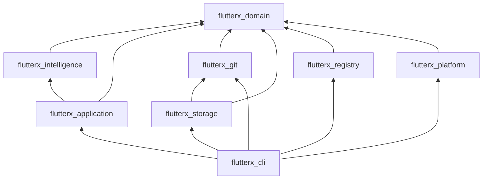
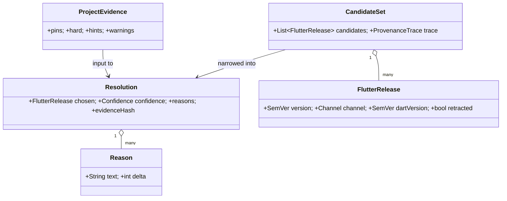

# FlutterX — Package Design

> **Document status:** Draft v1.0 · Design phase
> **Audience:** Implementers; reviewers checking dependency-rule compliance
> **Related docs:** [02-system-architecture.md](02-system-architecture.md) · [08-contributing-guide.md](08-contributing-guide.md)

The monorepo is managed with **melos**. Eight packages, one dependency rule: **inward only** (toward `flutterx_domain`).

```
flutterx/
├── melos.yaml
├── docs/
└── packages/
    ├── flutterx_domain/
    ├── flutterx_intelligence/
    ├── flutterx_application/
    ├── flutterx_git/
    ├── flutterx_storage/
    ├── flutterx_registry/
    ├── flutterx_platform/
    └── flutterx_cli/
```

## 1. Dependency Graph



`flutterx_cli`'s infrastructure imports are confined to a single `composition_root.dart`; everywhere else the CLI talks only to `flutterx_application`. Enforced by a custom lint + CI check (§ in [08-contributing-guide.md](08-contributing-guide.md)).

Folder convention inside every package:

```
packages/<name>/
├── lib/
│   ├── <name>.dart        # single public entry point (export barrel)
│   └── src/…              # everything else — not importable externally
├── test/
└── pubspec.yaml
```

---

## 2. `flutterx_domain`

**Responsibility:** the ubiquitous language — entities, value objects, failures, and the **interfaces** every other package implements or consumes. Zero dependencies beyond Dart core (+`pub_semver` re-exported behind `SemVer`).

### 2.1 Public API (representative)

```dart
// ── Value objects ────────────────────────────────────────
class SemVer { /* wraps pub_semver Version; total ordering */ }
class VersionConstraintX { bool allows(SemVer v); }
enum Channel { stable, beta, dev, master }   // dev = archived; exists only to parse historical releases
enum Confidence { high, medium, low }

// ── Entities ────────────────────────────────────────────
class FlutterRelease { SemVer version; Channel channel; String gitTag;
                       SemVer dartVersion; bool retracted; /* artifacts… */ }
class Project { String rootPath; ProjectKind kind; }
class ProjectEvidence { List<PinEvidence> pins; List<ConstraintEvidence> hard;
                        List<HintEvidence> hints; List<ScanWarning> warnings; }
class Resolution { FlutterRelease chosen; Confidence confidence;
                   List<Reason> reasons; String evidenceHash; }
class Diagnosis { String id; Severity severity; FixPlan plan; }
class UpgradeReport { SemVer from; SemVer to; Verdict verdict; /* … */ }

// ── Failures (sealed) ───────────────────────────────────
sealed class FxFailure { String get code; String get message; List<String> get nextActions; }
class ResolutionConflict extends FxFailure { /* minimal conflicting pair */ }
class VersionNotFound   extends FxFailure { /* suggestions */ }
class StorageFailure    extends FxFailure { /* … */ }

typedef Result<T> = ({T? value, FxFailure? failure});   // or sealed Ok/Err — final call at impl time

// ── Ports (implemented by infrastructure) ───────────────
abstract interface class SdkRepository {        // flutterx_git + flutterx_storage together
  Future<Result<InstalledSdk>> ensureInstalled(FlutterRelease release, {InstallOptions opts});
  Future<Result<void>> remove(SemVer version);
  Future<List<InstalledSdk>> installed();
}
abstract interface class RegistryPort {         // flutterx_registry
  Future<Result<RegistrySnapshot>> snapshot({bool refresh});
  Future<Result<PackageMeta>> packageMeta(String name, SemVer version);
}
abstract interface class ProjectStore {         // flutterx_storage
  Future<EvidenceFiles> readEvidence(Project p);
  Future<Result<void>> writeLock(Project p, Resolution r);
  Future<Result<void>> linkSdk(Project p, InstalledSdk sdk);
}
abstract interface class PlatformPort {         // flutterx_platform
  String get storeHome; LinkMode get linkMode;
  Future<int> exec(String bin, List<String> args, {bool inherit});
  Future<Result<void>> createLink(String from, String to);
}
abstract interface class Journal { /* begin/step/commit; §7 storage doc */ }

// ── Engine contracts (implemented by flutterx_intelligence) ──
abstract interface class ProjectScanner      { ProjectEvidence scan(EvidenceFiles files); }
abstract interface class VersionSolver      { CandidateSet solve(ProjectEvidence e, RegistrySnapshot s); }
abstract interface class Rule               { String get id; RuleVerdict evaluate(FlutterRelease r, RuleContext c); }
abstract interface class RecommendationEngine{ Recommendation rank(CandidateSet c, Signals s); }
abstract interface class UpgradeAdvisor     { UpgradeReport advise(/* … */); }
abstract interface class RepairPlanner      { List<Diagnosis> diagnose(HealthProbes p); }
```

**Design notes**
- Interfaces here are *ports* in hexagonal terms; infrastructure packages are *adapters*.
- Failures are a sealed hierarchy so the CLI can exhaustively map failure → exit code ([04-cli-specification.md](04-cli-specification.md) §1.2) with compiler enforcement.

### 2.2 Class diagram (core)



---

## 3. `flutterx_intelligence`

**Responsibility:** pure implementations of every engine contract ([03-sdk-intelligence.md](03-sdk-intelligence.md)). No I/O, no `dart:io` import (lint-enforced).

**Public API:** factory per engine + the extension points.

```dart
class IntelligenceSuite {
  factory IntelligenceSuite.standard({List<Rule> extraRules, List<EvidenceExtractor> extraExtractors});
  ProjectScanner get scanner;
  VersionSolver get solver;
  RuleEngine get rules;              // aggregates Rule instances
  RecommendationEngine get recommender;
  DependencyIntelligence get dependencies;
  UpgradeAdvisor get upgrades;
  RepairPlanner get repair;
}
```

Internal structure mirrors the engines one-to-one:

```
lib/src/
├── scanner/    extractors/ (pubspec, lockfile, metadata, ci, fvm, puro), scanner.dart
├── solver/     solver.dart, conflict_trace.dart
├── rules/      rule_engine.dart, builtin/ (channel_policy.dart, deny_retracted.dart, …)
├── recommend/  scoring.dart, signals.dart, confidence.dart
├── depintel/   fast_checker.dart, matrix.dart          # deep mode lives in application (needs process I/O)
├── upgrade/    advisor.dart, knowledge_base.dart
└── repair/     catalogue.dart, diagnoses/ …
```

**Key decision:** Dependency Intelligence *deep mode* (spawning `dart pub get --dry-run`) is **not** here — it needs process execution. The application layer implements it against `PlatformPort` and feeds results back in as `Signals`. Fast mode (pure computation over cached metadata) stays here.

---

## 4. `flutterx_application`

**Responsibility:** use cases — one class per user-visible operation; owns orchestration, locking, journaling and transactionality. This is the API a future daemon or IDE plugin consumes.

```dart
class FlutterXApi {                       // façade over all use cases
  factory FlutterXApi(Dependencies deps); // ports injected
  InstallSdk get install;                 // execute(VersionSpec, InstallOptions) → Result<InstalledSdk>
  RemoveSdk get remove;
  UseSdk get use;
  ResolveProject get resolve;             // full intelligence pipeline
  RecommendOnly get recommend;
  ShowCurrent get current;
  ListSdks get list;
  RunDoctor get doctor;                   // probes + RepairPlanner, read-only
  RepairEnvironment get repair;           // doctor + FixExecutors
  AdviseUpgrade get upgradeAdvise;
  ApplyUpgrade get upgradeApply;
  ManageCache get cache;                  // status/refresh/gc/verify
  WorkspaceOps get workspace;
  ProxyExec get proxy;                    // run/build/test/pub/shell passthrough
}
```

**Use-case pattern (uniform):**

```dart
class ResolveProject {
  Future<Result<Resolution>> execute(ResolveParams p) async {
    final files    = await projectStore.readEvidence(p.project);   // I/O
    final evidence = suite.scanner.scan(files);                    // pure
    final snapshot = await registry.snapshot(refresh: p.refresh);  // I/O
    final decision = pipeline(evidence, snapshot, policies);       // pure
    if (decision case Ok(:final resolution)) {
      await sdkRepository.ensureInstalled(resolution.chosen);      // I/O (journaled)
      await projectStore.writeLock(p.project, resolution);
      await projectStore.linkSdk(p.project, installed);
    }
    return decision;
  }
}
```

I/O at the edges, pure decision in the middle — every use case follows this sandwich, which is what makes the whole application testable with fakes.

---

## 5. `flutterx_git`

**Responsibility:** all git operations, via the system `git` binary (decision: shelling out to git ≥ 2.30 rather than a Dart git implementation — worktrees and partial clone must be battle-tested, not reimplemented).

```dart
abstract interface class GitEngine {       // consumed by storage's SdkRepository impl
  Future<Result<void>> ensureBareRepo(String url);
  Future<bool> hasTag(String tag);                   // "if tag not in bareRepo" (05 §4.1)
  Future<Result<void>> fetchTag(String tag);         // partial clone; full-fetch fallback internal (05 §4.1)
  Future<Result<String>> addWorktree(String tag, String path);
  Future<Result<void>> removeWorktree(String path);
  Future<GitHealth> fsck();                          // summary for doctor/repair
  Future<Result<void>> repack({bool aggressive});
}
```

Includes: git version detection (with minimum-version error), stderr→`FxFailure` translation table (`FX-GIT-*` codes), and retry policy for transient network fetch failures (3 attempts, backoff, resumable via git's own negotiation).

---

## 6. `flutterx_storage`

**Responsibility:** the store on disk — layout ([05-storage-design.md](05-storage-design.md)), CAS, downloads, GC, journal, state.json, project registry. Implements `SdkRepository` (composing `GitEngine`), `ProjectStore`, `Journal`.

```dart
class ArtifactStore {                      // CAS
  Future<Result<CasRef>> ensure(ArtifactRef remote);   // download→verify→commit (atomic)
  Future<Result<void>> linkInto(CasRef ref, String versionPath);
  Future<VerifyReport> verify();
  Future<Set<CasRef>> unreferenced(Set<CasRef> live);
}
class DownloadManager {                    // resumable, concurrent-safe
  Future<Result<File>> fetch(Uri url, String sha256, {ProgressSink? progress});
}
class StoreGc { Future<GcReport> run(GcOptions o); }
class StoreLock { Future<T> withExclusive<T>(Future<T> Function() body); }
```

---

## 7. `flutterx_registry`

**Responsibility:** implements `RegistryPort` — releases index client, pub.dev metadata client, snapshot cache with TTL/etag, bundled seed snapshot.

```dart
class ReleasesClient  { Future<Result<RegistrySnapshot>> fetch(TargetOs os); }
class PubMetaClient   { Future<Result<PackageMeta>> fetch(String name, SemVer v); }
class SnapshotCache   { RegistrySnapshot? read(); void write(RegistrySnapshot s); }
```

Network policy: honest offline behavior — cached snapshot + explicit staleness warnings, never silent failure ([03-sdk-intelligence.md](03-sdk-intelligence.md) §1.2).

---

## 8. `flutterx_platform`

**Responsibility:** implements `PlatformPort`. The **only** package (besides storage/git internals) allowed to branch on `Platform.isWindows` etc.

Covers: home/store path resolution (incl. `FLUTTERX_HOME`), link mode probing (hardlink/symlink/junction/copy — probed once, cached in `state.json`), process execution with signal forwarding and inherited stdio, shell detection for `shell` command and PATH advice, long-path handling on Windows.

Also owns the **shim implementations** (templates + installer): POSIX shell shims and Windows `.exe`/`.bat` shims live here as assets; `doctor`/`repair` call `ShimInstaller.ensure()`.

---

## 9. `flutterx_cli`

**Responsibility:** presentation only.

```
lib/src/
├── composition_root.dart      # the ONE place infra is constructed & wired
├── commands/                  # one file per command, maps args → use case params
├── output/                    # console renderer: tables, spinners, --json envelope, error formatter
└── exit_codes.dart            # FxFailure → exit code (exhaustive switch over sealed types)
```

Uses `package:args` command runner. Rules:
- A command class contains **no logic** beyond argument mapping and rendering — if a command grows an `if` about domain state, that logic moves down a layer.
- `--json` output is a versioned envelope: `{"apiVersion":1,"ok":true,"data":{…}}` — a public contract for CI scripts.

---

## 10. Testing Seams (summary)

| Package | Test style |
|---|---|
| domain | value-object laws (ordering, constraint algebra) |
| intelligence | pure unit tests: evidence strings in → decisions out; golden files for explanations |
| application | use cases against in-memory fakes of all ports |
| git/storage/registry/platform | integration tests against real git/tmp dirs/recorded HTTP; tagged `integration` |
| cli | golden output tests (`--json` and human), exit-code matrix |
| end-to-end | melos script: real store in tmp HOME, `install → use → run --version` on 2 OS matrix |

Full strategy in [08-contributing-guide.md](08-contributing-guide.md).

---

*Next: [07-development-roadmap.md](07-development-roadmap.md).*
