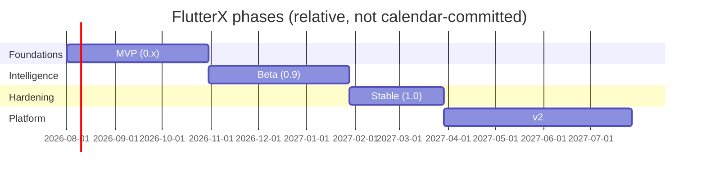

# FlutterX — Development Roadmap

> **Document status:** Draft v1.0 · Design phase
> **Audience:** Maintainers, contributors picking up work
> **Related docs:** [01-product-vision.md](01-product-vision.md) · all design docs 02–06

Guiding principle: **every phase ships something independently useful.** MVP must already beat the status quo on storage + DX; intelligence lands incrementally on top.

---

## Phase 1 — MVP (v0.1 → v0.5) · "A better Puro/FVM"

**Goal:** storage engine + core commands, rock-solid on macOS/Linux, functional on Windows.
**Exit criterion:** a developer manages 3+ SDK versions across 3+ projects with FlutterX alone; disk usage ≤ 40% of full copies.

| Priority | Milestone | Scope (docs reference) |
|---|---|---|
| P0 | M1.1 Monorepo scaffold | melos, 8 packages, CI skeleton, dependency-rule lint (06) |
| P0 | M1.2 Domain core | entities, failures, ports (06 §2) |
| P0 | M1.3 Git engine | bare repo, partial fetch, worktrees, fsck (05 §4) |
| P0 | M1.4 Storage engine | layout, CAS, downloads, journal, store lock (05) |
| P0 | M1.5 Registry (basic) | releases index client + snapshot cache + seed (03 §1) |
| P0 | M1.6 Commands: `install`, `remove`, `list`, `use`, `current` | (04) |
| P0 | M1.7 Shims + project linking | fast path via lock (02 §8.3) |
| P1 | M1.8 `doctor` (read-only probes) + `cache status/refresh` | (03 §9, 04) |
| P1 | M1.9 `run`/`build`/`test`/`pub`/`shell` proxies | (04 §3.13) |
| P1 | M1.10 FVM/Puro config reading (migration) | scanner extractors, pin-level only (03 §2) |
| P2 | M1.11 Windows parity pass | junctions, shims, long paths (05 §8) |

Explicitly **out** of MVP: solver, recommendation, upgrade advisor, repair executors, workspaces.

## Phase 2 — Beta (v0.9) · "SDK Intelligence arrives"

**Goal:** the flagship pipeline end-to-end; the `clone → flutterx resolve → run` story works.
**Exit criterion:** G2 metric ≥ 90% on a corpus of ~50 real open-source Flutter apps (test corpus checked into CI as fixtures).

| Priority | Milestone | Scope |
|---|---|---|
| P0 | M2.1 Full Project Scanner | all evidence extractors + warnings (03 §2) |
| P0 | M2.2 Version Solver + conflict explanations | (03 §3) |
| P0 | M2.3 Rule Engine + built-in rules + policy precedence | (03 §4) |
| P0 | M2.4 Recommendation Engine + `--explain` | scoring, confidence (03 §5) |
| P0 | M2.5 `resolve` / `recommend` commands + lockfile v1 | (04 §3.4) |
| P1 | M2.6 Dependency Intelligence (fast mode) + pub metadata cache | (03 §6) |
| P1 | M2.7 Repair Engine: catalogue FX-R01…R05 + `repair` command | (03 §9) |
| P1 | M2.8 `cache gc` + reference counting | (05 §6) |
| P2 | M2.9 Corpus-based accuracy CI + perf benchmarks vs targets | (05 §9) |

## Phase 3 — Stable (v1.0) · "Trustworthy by default"

**Goal:** completeness, hardening, docs. Semver commitment begins: CLI surface, exit codes, `--json` schema, lockfile format frozen.
**Exit criterion:** all product-goal metrics (01 §3) measured and met; zero P0/P1 bugs open for 30 days.

| Priority | Milestone | Scope |
|---|---|---|
| P0 | M3.1 Upgrade Advisor (advise + apply + `--bump-deps`) | deep mode dependency sim (03 §8) |
| P0 | M3.2 Repair completion | FX-R06…R09, journal roll-forward/back (05 §7) |
| P0 | M3.3 Workspace support | `workspace` command, intersection solve (04 §3.12) |
| P0 | M3.4 Windows first-class | full CI matrix gate, shim edge cases |
| P1 | M3.5 Store schema migrations framework | (05 §10) |
| P1 | M3.6 Docs site + man pages generated from command specs | single-source-of-truth from CLI definitions |
| P1 | M3.7 Security pass | artifact hash enforcement everywhere, journal audit, threat notes |
| P2 | M3.8 Breaking-change knowledge base seeded (3.16→latest) | curated YAML (03 §8) |

## Phase 4 — v2 · "Platform, not tool"

**Goal:** FlutterX as infrastructure other tools build on.

| Priority | Milestone | Scope |
|---|---|---|
| P0 | M4.1 FlutterX Daemon | JSON-RPC host over `flutterx_application` (02 §7.1) |
| P0 | M4.2 IDE integrations | VS Code extension + IntelliJ plugin consuming the daemon (status bar version, one-click resolve/repair) |
| P1 | M4.3 Org policy distribution | signed policy files via git URL, lockdown rules (03 §4.3) |
| P1 | M4.4 Official CI actions | GitHub Action / GitLab template with store caching |
| P1 | M4.5 Plugin API v1 | third-party rules, extractors, repair strategies — stability contract |
| P2 | M4.6 Artifact mirror support | org-hosted CAS remote (02 §10.5) |

## Phase 5 — Future (exploratory, unscheduled)

- **Predictive upgrade advisor:** ecosystem-readiness signals (what fraction of your dep graph already supports SDK X) → "upgrade now / wait ~3 weeks" advice.
- **Standalone Dart SDK management** (non-Flutter Dart projects).
- **Cloud resolution cache:** share registry + pub metadata snapshots org-wide for hermetic CI.
- **Opt-in anonymous metrics** (only if governance for it exists; default stays off — vision doc §8).
- **`flutterx init` project templates** with best-practice pins and policies.

## Cross-Phase Priorities

1. **Correctness > speed > features.** A wrong resolution or a corrupted store is product-fatal; a missing feature is not.
2. **Windows never slips more than one milestone** behind POSIX (history shows "later" becomes "never").
3. **Docs move with code.** A milestone is done when its design doc §, CLI help, and tests agree.
4. **Public contracts change only at major versions** once 1.0 ships: exit codes, `--json`, lockfile, store schema (with migration).

## Risks & Mitigations

| Risk | Impact | Mitigation |
|---|---|---|
| Flutter infra changes (releases JSON format, artifact URLs) | breaks registry/install | seed snapshots, tolerant parsers, contract tests hitting real endpoints nightly |
| Git partial-clone quirks across git versions | install failures | minimum git version gate + fallback to full tag fetch (05 §4.1) |
| Recommendation accuracy below target | trust damage | corpus CI from Beta on; confidence gating keeps low-confidence cases interactive |
| Windows filesystem semantics | corruption/links broken | linkmode probing + copy fallback; Windows CI is a merge gate from M1.11 |
| Scope creep into build-system territory | unfocused product | non-goals list (01 §8) enforced in triage |

---

*Next: [08-contributing-guide.md](08-contributing-guide.md).*
